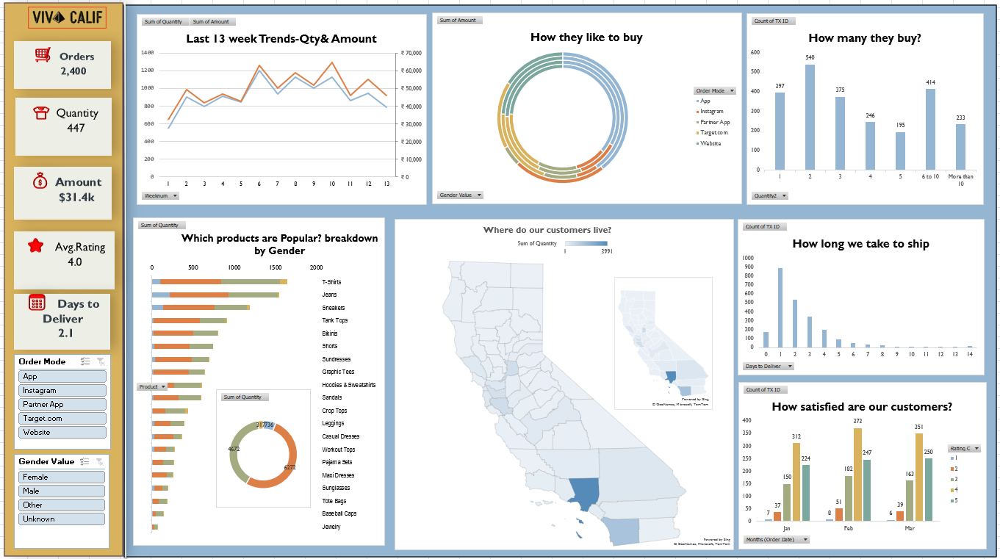

# VIVA CALIF — Ecommerce Sales Dashboard 🛍️

An interactive **Excel dashboard** (PivotTables, PivotCharts, Slicers & Map Charts) built to analyze 13 weeks of California ecommerce sales for a fictional apparel brand, **VIVA CALIF**.



---

## 📌 Project Overview

VIVA CALIF sells apparel (t-shirts, jeans, dresses, sneakers, accessories, etc.) online through multiple channels — App, Website, Target.com, Instagram, and Partner App. This dashboard turns 13 weeks of raw order-level transaction data into a single-page, fully interactive Excel report that answers the business's core questions about orders, customers, products, delivery, and satisfaction.

Built entirely with **native Excel features** — no Power BI, no VBA — to demonstrate PivotTable/PivotChart design, dashboard layout, and interactivity skills.

---

## 🎯 KPIs Tracked

| KPI | Description |
|---|---|
| **Orders** | Total number of transactions |
| **Quantity** | Total units sold |
| **Amount** | Total revenue generated |
| **Avg. Rating** | Average customer satisfaction rating (1–5) |
| **Days to Deliver** | Average delivery time (Order Date → Ship Date) |

> KPI cards are pivot-driven, so every number updates live as slicers are applied.

---

## ❓ Business Questions Answered

| # | Question | Visual |
|---|---|---|
| 1 | What's the trend in the last 13 weeks? | Line chart — Qty & Amount by week |
| 2 | How do customers like to buy? | Multi-ring donut — Order Mode split by Gender |
| 3 | How many units do they buy per order? | Column chart — order count by quantity bucket |
| 4 | Which products are popular? | Horizontal bar — product sales broken down by gender |
| 5 | What's the overall gender split? | Mini donut chart |
| 6 | Where do customers live? | Filled Map (California, by county) + inset overview map |
| 7 | How long do we take to ship orders? | Column chart — orders by days-to-deliver |
| 8 | How happy are customers? | Stacked column — rating distribution by month |

---

## 🧩 Interactivity — Slicers

Two slicers drive the whole dashboard and are connected to **every** PivotTable/PivotChart via Report Connections:

- **Order Mode** — App, Instagram, Partner App, Target.com, Website
- **Gender Value** — Female, Male, Other, Unknown

Selecting any option instantly filters all charts and KPI cards together.

### How the slicers were added (step-by-step)
1. Click inside any PivotTable → **PivotTable Analyze** tab → **Insert Slicer**.
2. Check the fields to slice by — `Order Mode` and `Gender Value` — click **OK**.
3. Right-click each slicer → **Report Connections** (a.k.a. *PivotTable Connections*) → tick **every** PivotTable that feeds a chart on the dashboard, so one slicer click updates all visuals at once.
4. Style the slicer (**Slicer** tab → **Slicer Styles**) to match the dashboard's color theme.
5. Resize and position the slicers in the left-hand control panel of the dashboard.
6. Repeat Report Connections whenever a new PivotTable/PivotChart is added, so it stays in sync.

---

## 🗂️ Repository Structure

```
├── ecommerce-blank_dataset.xlsx        # Raw/cleaned transaction data (source table)
├── ecommerce-blank_excel_project.xlsx  # Full Excel workbook — Data, Questions & KPIs, Dashboard, helper sheet
├── ecommerse-blank_dashboard.png       # Dashboard snapshot / screenshot
├── Questions___KPIs.png                # Planning snapshot — KPIs & business questions
├── README.md                           # Project overview (this file)
└── Documentation.md                    # Detailed build documentation
```

---

## 🛠️ Tools & Techniques Used

- Microsoft Excel — **PivotTables** & **PivotCharts**
- **Slicers** with Report Connections for cross-chart filtering
- Native Excel **Filled Map** chart (Bing-powered geography) for the California county map
- Calculated/helper columns (`Gender Value`, `Weeknum`, `Days to Deliver`)
- Dashboard-style layout: KPI cards, icon styling, unified color theme

---

## 📊 Dataset Summary

- **2,400** order-level transaction records
- **13 weeks** of data (Jan – Mar 2025)
- **20** product types across apparel categories
- All orders located in **California** (58 counties)

---

## 💡 Key Insights

- **T-Shirts, Jeans, and Sneakers** are the top-selling products.
- **App and Website** are the two dominant ordering channels.
- The majority of orders ship within **0–3 days**.
- Customer satisfaction skews positive — most ratings fall in the **4–5 range**.
- A noticeable spike in weekly orders occurs around **week 10–11** of the 13-week period.

---

## 📸 Dashboard Preview

See `ecommerse-blank_dashboard.png` **[ecommerse-blank_dashboard.png](https://github.com/DRasool7013/VIVA-CALIF-Ecommerce-Sales-Dashboard/blob/main/ecommerse-blank_dashboard.png)**.for the full interactive dashboard layout, and `Questions___KPIs.png`  **[Questions___KPIs.png](https://github.com/DRasool7013/VIVA-CALIF-Ecommerce-Sales-Dashboard/blob/main/Questions%20%26%20KPIs.png)**for the original KPI/question planning notes this project was scoped from.

---

## 👤 Author

** D. Alla Rasool **
Data Analyst | Excel · Data Visualization · Business Analysis
📧 rasoolpinjari0@gmail.com
🔗 LinkedIn: [www.linkedin.com/in/drasool7663]
🔗 GitHub: [github.com/DRasool7013]
•  [Portfolio](#)

Feel free to connect or raise an issue if you have suggestions for improving this dashboard.


